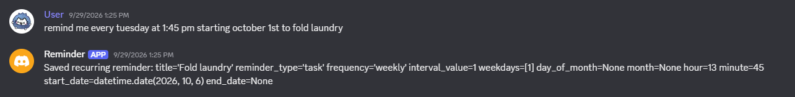
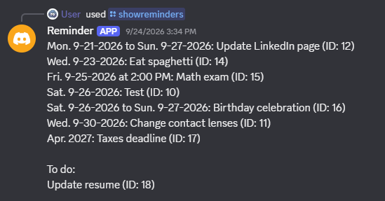

# Project Overview
Discord bot for convenient reminders. Uses OpenAI API to extract tasks, events, and important reminders from natural user conversation.  
Structured data is stored in Supabase/PostgreSQL and support retrieval through app commands.  

## Current state
  
  

## Roadmap
- Implement natural language querying for personal reminders
- Use RAG on conversation history
- Add privacy settings
- Improve how reminders are displayed
- Containerization and deployment